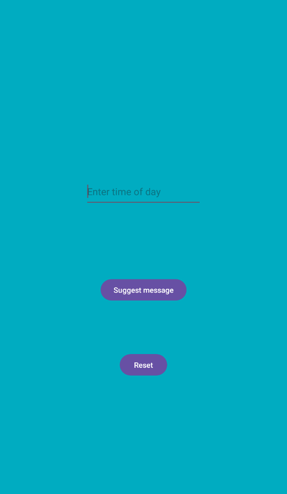
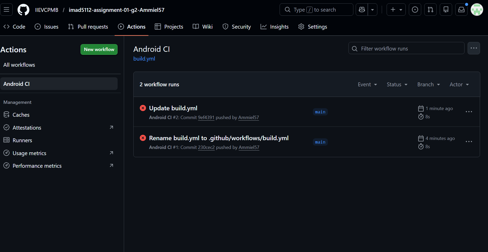

# Social Spark Android Application

## 1. Project Purpose
Social Spark is a Kotlin-based Android application designed to bridge the gap in digital social interactions. The app provides users with specific "social sparks" or interaction suggestions based on the time of day they input. The goal is to encourage meaningful connections by giving users a simple prompt to reach out to friends, family, or colleagues at optimal times.

## 2. Technical Considerations
### Development Environment
* **Language:** Kotlin
* **IDE:** Android Studio
* **Architecture:** UI-driven logic utilizing structured `if/else` nesting for decision-making.

### User Interface (UI) Design
The UI was designed to be clean and captivating, featuring:
* An interactive input field for time entry.
* High-contrast buttons for "Suggest message" and "Reset."
* A dynamic results display area that updates based on logic triggers.

### Logic Structure
The application uses nested `if` statements to validate user input and categorize suggestions. This ensures that the app remains robust and only provides suggestions when valid data is entered.

---

## 3. Application Demo
Below is a demonstration of the Social Spark app in action.

 The main interface of the Social Spark application.*

### Walkthrough Video
You can watch the full voice-over demonstration of the app's functionality here:
[https://youtu.be/f5wgzuLEgwg]

---

## 4. Version Control and CI/CD
### GitHub Integration
This project utilizes GitHub for version control, allowing for transparent tracking of changes and collaboration. 
* **Repository Management:** Consistent commits were made to document the development process.
* **Documentation:** This README serves as the central documentation hub for the repository.

### GitHub Actions (Automated Building)
To ensure a "robust and maintainable application," I implemented **GitHub Actions**.
* **Purpose:** Every time code is pushed to the repository, an automated build script runs.
* **Benefit:** This checks for compilation errors and ensures that the app is always in a "build-ready" state, preventing broken code from staying in the main branch.

 build status by GitHub Actions

---

## 5. How to Use
1.  **Input:** Enter a time (e.g., "Morning", "Afternoon", "Dinner") into the text field.
2.  **Suggest:** Click the **Suggest message** button to see your prompt.
3.  **Reset:** Use the **Reset** button to clear the input and start over.

---
**Developed by:** Ammiel Singh  
**Course Module:** Programming Theory / Technical Writing  
**Date:** March 2026
